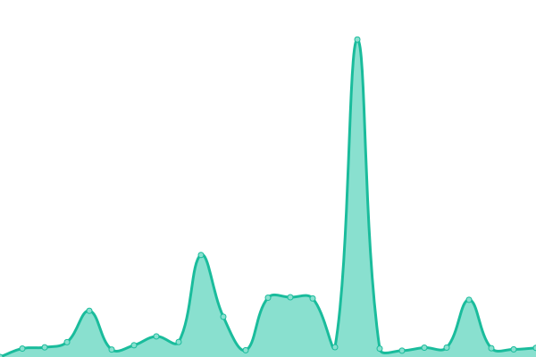

# [📈 Live Status](https://demo.upptime.js.org): <!--live status--> **🟧 Partial outage**

This repository contains the open-source uptime monitor and status page for [Amar Tukimin](https://demo.upptime.js.org), powered by [Upptime](https://github.com/upptime/upptime).

With [Upptime](https://upptime.js.org), you can get your own unlimited and free uptime monitor and status page, powered entirely by a GitHub repository. We use [Issues](https://github.com/amrkmn/upptime/issues) as incident reports, [Actions](https://github.com/amrkmn/upptime/actions) as uptime monitors, and [Pages](https://demo.upptime.js.org) for the status page.

<!--start: status pages-->
<!-- This summary is generated by Upptime (https://github.com/upptime/upptime) -->
<!-- Do not edit this manually, your changes will be overwritten -->
<!-- prettier-ignore -->
| URL | Status | History | Response Time | Uptime |
| --- | ------ | ------- | ------------- | ------ |
|  [Pocket ID](https://id.ujol.dev/health) | 🟥 Down | [pocket-id.yml](https://github.com/amrkmn/upptime/commits/HEAD/history/pocket-id.yml) | 

 753ms
     
 | 

<a href="https://amrkmn.github.io/upptime/history/pocket-id">99.99%</a>
    

|  [ReddViz](https://reddviz.amar.kim/gimme) | 🟩 Up | [redd-viz.yml](https://github.com/amrkmn/upptime/commits/HEAD/history/redd-viz.yml) | 

 584ms
     
 | 

<a href="https://amrkmn.github.io/upptime/history/redd-viz">100.00%</a>
    

|  [ReddViz Deno](https://reddviz.deno.dev/gimme) | 🟩 Up | [redd-viz-deno.yml](https://github.com/amrkmn/upptime/commits/HEAD/history/redd-viz-deno.yml) | 

 1541ms
     
 | 

<a href="https://amrkmn.github.io/upptime/history/redd-viz-deno">100.00%</a>
    

|  [HasteBin](https://hst.ujol.dev) | 🟩 Up | [haste-bin.yml](https://github.com/amrkmn/upptime/commits/HEAD/history/haste-bin.yml) | 

 549ms
     
 | 

<a href="https://amrkmn.github.io/upptime/history/haste-bin">100.00%</a>
    

|  [Dumb](https://dumb.onrender.com) | 🟩 Up | [dumb.yml](https://github.com/amrkmn/upptime/commits/HEAD/history/dumb.yml) | 

 3219ms
     
 | 

<a href="https://amrkmn.github.io/upptime/history/dumb">99.25%</a>
    

<!--end: status pages-->

[**Visit our status website →**](https://demo.upptime.js.org)

## 📄 License

- Powered by: [Upptime](https://github.com/upptime/upptime)
- Code: [MIT](./LICENSE) © [Anand Chowdhary](https://anandchowdhary.com), supported by [Pabio](https://pabio.com)
- Data in the `./history` directory: [Open Database License](https://opendatacommons.org/licenses/odbl/1-0/)
